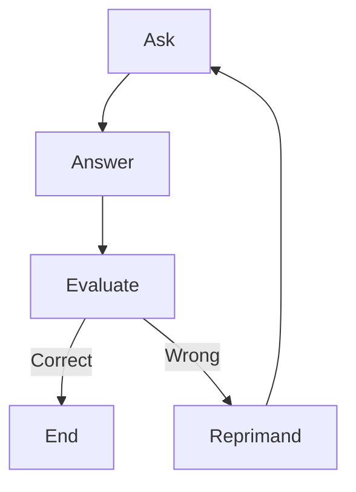

# ❓ Question Graph with Pydantic AI & Pydantic Graph

This project is an interactive question-answer-evaluation loop built using:

* 🧠 [`pydantic_ai`](https://github.com/pydantic/pydantic-ai): typed LLM agents using Pydantic
* 🔄 [`pydantic_graph`](https://github.com/pydantic/pydantic-graph): node-based execution graphs
* 📊 [`logfire`](https://logfire.dev): (optional) telemetry and agent trace instrumentation

It generates trivia-style questions, asks the user to answer them, and uses an LLM to evaluate correctness. Wrong answers result in a snarky reprimand and another round.

---

## 🧱 How It Works

The interaction flow is managed as a stateful graph:



The `Graph` persists state between runs using a local file (`question_graph.json`), making it resume-friendly.

---

## 📦 Installation

Install dependencies:

```bash
pip install pydantic-ai pydantic-graph logfire groq
```

Set your OpenAI (or other model provider) credentials appropriately:

```bash
export OPENAI_API_KEY=sk-...
```

Optionally set `LOGFIRE_API_KEY` for observability.

---

## 🚀 Running the App

There are three modes of execution:

### 🧪 Continuous Mode

Autonomously runs the full loop:

```bash
uv run -m pydantic_ai_examples.question_graph continuous
```

The model asks, you answer, and it evaluates until you get it right.

---

### 🖐️ CLI Mode (Interactive + Persistent)

Runs one step at a time, persisting state in `question_graph.json`.

First run (asks a question):

```bash
uv run -m pydantic_ai_examples.question_graph cli
```

Second run (with your answer):

```bash
uv run -m pydantic_ai_examples.question_graph cli "New York"
```

---

### 🧭 Mermaid Mode (Visualize the Graph)

```bash
uv run -m pydantic_ai_examples.question_graph mermaid
```

Outputs the Mermaid.js graph definition for documentation or visualization.

---

## 📂 File Structure

| File                  | Description                               |
| --------------------- | ----------------------------------------- |
| `question_graph.py`   | Main graph logic and entry point          |
| `question_graph.json` | Local persisted state (if using CLI mode) |

---

## 📚 Internals

* Nodes: `Ask`, `Answer`, `Evaluate`, `Reprimand`
* State: Captured in `QuestionState`, includes previous agent messages for context
* Evaluation: Uses XML-formatted prompt with question and answer
* Model: Defaults to `openai:gpt-4o` for evaluation, `gpt-4o-mini` for question generation

---

## 🤖 Agents

Two agents are used:

* **ask\_agent**: Generates a trivia question
* **evaluate\_agent**: Checks if the user's answer is correct and provides feedback

---

## 💡 Ideas to Extend

* Add scoring and difficulty levels
* Support multiple-choice generation
* Integrate audio (e.g., via TTS or STT)
* Add support for LangGraph or other backends
* Persist full interaction history for review

---

## 🪪 License

MIT. Use it, fork it, abuse it — just don’t blame us if the LLM says your answer was dumb.

---

